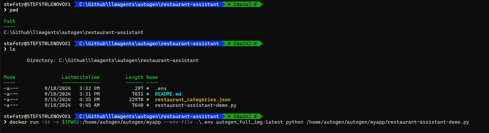

# Restaurant Assistant

This example demonstrates how to use the AutoGen platform to create an LLM Agent that provides restaurant recommendations based on the user's location. The LLM Agent utilizes function calls to the Azure Maps REST API to fetch the required information and shares it with an AI model in Azure.


## Features

- Get restaurant recommendations based on user-provided location.
- Utilize Azure Maps REST API for location-based data.
- Integrate with AI models in Azure for intelligent recommendations.

## Prerequisites

- Azure Subscription with access to Azure Maps and AI services.
- Docker (for Windows).
- AutoGen LLM Agent Platform (included in Docker image)
- API keys for Azure Maps and Azure OpenAI.

## Setup

1. **Install Docker for Code Execution**
   To install Docker, follow the instructions for your operating system on the [Docker website](https://docs.docker.com/get-docker/).
   More information about how to use AutoGen with Docker can be found [here](https://microsoft.github.io/autogen/docs/installation/Docker).

1. **Clone this repository:**

    ```sh
    git clone https://github.com/stefanstranger/restaurant-assistant.git
    cd restaurant-assistant
    ```

1. **Deploy an Azure Open AI Instance**
   The restaurant-assistant-demo.py Python script is using an Azure OpenAI instance, that first needs to be deployed.

   Follow the [Microsoft Learn documentation](https://learn.microsoft.com/en-us/azure/ai-services/openai/how-to/create-resource) to create and deploy an Azure OpenAI Service Resource.

   - Copy the Azure OpenAI **Key** and store the value in the .env file where is states "your_actual_api_key_here"

   - Copy the Azure OpenAI **Endpoint** and store the value in the .env file where is states "https://your_openai_base_url_here"
  
    Also check if the model configuration is aligned with the model you are deploying in the next step.

   .env content:

   ```bash
   OAI_CONFIG_LIST=[{"model": "gpt-4o","api_key": "your_actual_api_key_here","base_url": "https://your_openai_base_url_here","api_type": "azure","api_version": "2023-03-15-preview"}] 
   AZURE_SUBSCRIPTION_KEY=your_actual_azure_subscription_key_here
    ```

   Deploy a model.

   I choose the following model to be deployed when developing this demo:
   - Model name: gpt-4o
   - Model version: 2024-05-13
   - Version update policy: Once the current version expires.
   - Deployment type: Global-Standard
   - Content Filter: Microsoft.DefaultV2
   - Tokens per Minute Rate Limit (thousands): 50
   - Rate limit (Tokens per minute): 50000
   - Rate limit (Requests per minute): 300

1. **Deploy Azure Maps Account**
   The LLM Agent (restaurant-assistant-demo.py Python script) is using Azure Maps to collect information about the available restaurants in a certain location. That requires an Azure Maps Account being deployed in Azure.

   Follow the documentation on [Microsoft Learn](https://learn.microsoft.com/en-us/azure/azure-maps/how-to-manage-account-keys#create-a-new-account) to deploy the Azure Maps Account.

   When finished copy the Azure Maps Account Shared Key Authentication value and store that in the .env file where is states "your_actual_azure_subscription_key_here"


1. **Verify the deployment:**
    - Run the Python script (restaurant-assistant-demo.py) in your Docker container to ensure it can connect to the Azure OpenAI instance and perform inference.
    From within a (PowerShell) host go to the folder where you cloned this repository and run:

    ```powershell
    docker run -it -v ${PWD}:/home/autogen/autogen/myapp --env-file .\.env autogen_full_img:latest python /home/autogen/autogen/myapp/restaurant-assistant-demo.py
    ```

    Explanation:
    The provided command is used to run a Docker container with specific configurations. Let's break down each part of the command to understand its functionality:

    - docker run: This is the basic Docker command to run a container.
    - -it: These flags are used to run the container in interactive mode with a terminal attached. The -i flag keeps STDIN open even if not attached, and the -t flag allocates a pseudo-TTY.
    - -v ${PWD}:/home/autogen/autogen/myapp: This option mounts a volume. ${PWD} is an environment variable that represents the current working directory on your host machine. This directory is mapped to /home/autogen/autogen/myapp inside the container, allowing the container to access files from your host machine.
    - --env-file .\.env: This option specifies an environment file to set environment variables inside the container. The .env file contains key-value pairs of environment variables that the container will use.
    - cls
    - autogen_full_img:latest: This is the name and tag of the Docker image to use. In this case, it is autogen_full_img with the latest tag.
    - python /home/autogen/autogen/myapp/geolocation_demo.py: This part of the command specifies the command to run inside the container. Here, it runs a Python script located at /home/autogen/autogen/myapp/geolocation_demo.py.
    
    In summary, this Docker command runs a container interactively, mounts the current working directory to a specific path inside the container, uses environment variables from a specified file, and executes a Python script within the container.

    
      
    

## Usage

1. **Start the application:**
    ```powershell
    docker run -it -v ${PWD}:/home/autogen/autogen/myapp --env-file .\.env autogen_full_img:latest python /home/autogen/autogen/myapp/restaurant-assistant-demo.py
    ```

2. **Interact with the LLM Agent:**
    Provide your location to get restaurant recommendations.

## How It Works (restaurant-assistant-demo.py)

1. **User Input:**
    The user provides their location to the LLM Agent or uses the default location (Haarlem, the Netherlands) being provided.

2. **Function Call to Azure Maps:**
    The LLM Agent makes a function call to the Azure Maps REST API to fetch restaurant data based on the provided location.

3. **AI Model Processing:**
    The fetched data is sent to an AI model in Azure, which processes the information and generates restaurant recommendations.

4. **Response:**
    The LLM Agent returns the restaurant recommendations to the user.

## restaurant-assistant-demo.py explanation

**Imports and Logging Setup**

The script begins by importing necessary modules such as http.client, requests, urllib.parse, autogen, os, json, logging, and re. It also sets up a logger to handle warnings.

**Configuration and Agent Initialization**

1. Loading Configuration: The script loads LLM (Large Language Model) inference endpoints from an environment variable or a file using autogen.config_list_from_json.
1. LLM Configuration: A dictionary llm_config is defined to store the configuration list and a timeout value.
1. AssistantAgent: An instance of AssistantAgent named chatbot is created with a specific system message and the LLM configuration.
1. UserProxyAgent: An instance of UserProxyAgent named user_proxy is created with parameters to handle termination messages, human input mode, and maximum consecutive auto-replies.
Loading Restaurant Categories
The script loads restaurant categories from a JSON file named restaurant_categories.json located in the same directory as the script.

**Function Definitions**

1. get_category_name: This function retrieves the category name from the JSON file using a regular expression to match the provided category string.
1. get_address: This function retrieves the address information from Azure Maps using a query string. It sends an HTTP GET request to the Azure Maps API and returns the response as a formatted JSON string.
1. get_restaurant_info: This function retrieves restaurant information from Azure Maps using longitude, latitude, and category ID. It sends an HTTP GET request to the Azure Maps API and returns the response as a formatted JSON string.
1. get_distance: This function calculates the distance between two geocoordinates using the Azure Maps API. It sends an HTTP POST request with the coordinates and retrieves the result from a location URL provided in the response headers.

**Function Registration**

The script registers several functions for execution by the user_proxy and chatbot agents:

1. geolocation_demo: Registered as "Geolocation assistant" to handle geolocation queries.
1. restaurant_demo: Registered as "Restaurant assistant" to handle restaurant information queries.
1. restaurant_category_demo: Registered as "Restaurant Category Assistant" to handle restaurant category queries.
1. restaurant_distance_demo: Registered as "Distance Assistant" to handle distance calculation queries.

**Assertion and Conversation Initiation**

The script includes an assertion to ensure that the geolocation_demo function is correctly mapped in the user_proxy function map. Finally, it initiates a chat with the chatbot using the user_proxy agent, starting a conversation with a query about the location of Haarlem in the Netherlands.

**Summary**

In summary, this script sets up an automated agent system capable of handling geolocation and restaurant-related tasks using Azure Maps and a language model. It defines and registers several functions to perform these tasks and initiates a conversation to demonstrate the system's capabilities.

## License

This project is licensed under the MIT License. See the [LICENSE](LICENSE) file for details.
